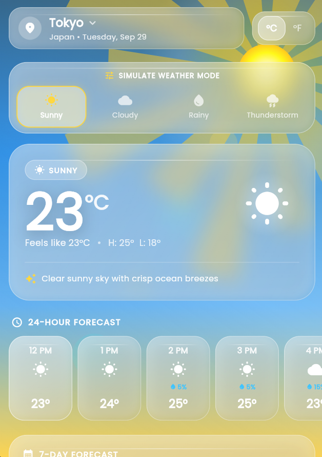
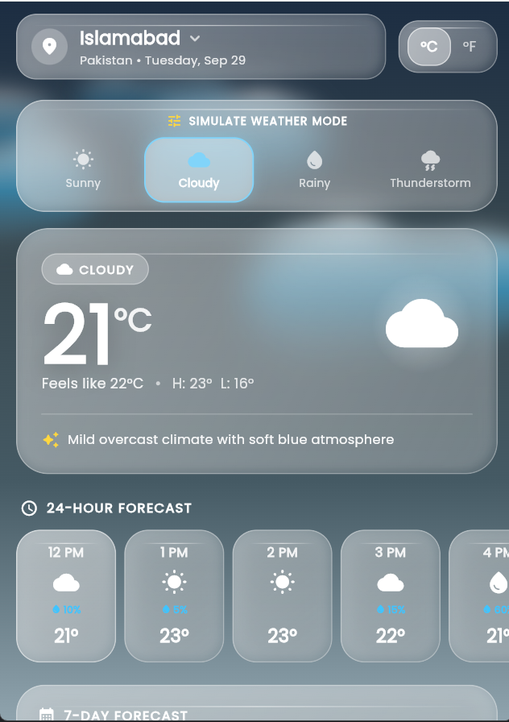
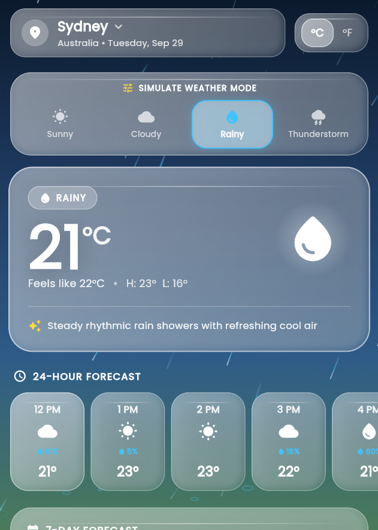
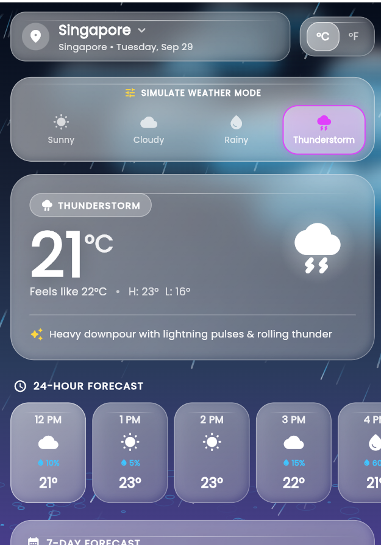

<div align="center">

# 🌤️ Aura Weather — Glossy Edition

**A glassmorphism weather app built with Flutter, featuring live conditions, animated weather scenes, and a rich forecast dashboard.**


</div>

---

## 📖 Overview

**Aura Weather** is a visually polished, cross-platform weather application written in Flutter. It pairs a frosted-glass ("glossy") UI with fully custom-painted weather animations — rotating sun rays, drifting clouds, falling rain with splash rings, and a stormy thunderstorm scene — so the entire background reacts to the current weather.

Live current conditions are fetched from [WeatherAPI.com](https://www.weatherapi.com/). If the network request fails or no API key is configured, the app gracefully falls back to built-in demo data, so the UI always renders.

---

## 📸 Screenshots

<div align="center">

| ☀️ Sunny — Tokyo | ☁️ Cloudy — Islamabad |
|:---:|:---:|
|  |  |

| 🌧️ Rainy — Sydney | ⛈️ Thunderstorm — Singapore |
|:---:|:---:|
|  |  |

</div>

---

## ✨ Features

### 🎨 Design & Animation
- **Glassmorphism UI** — translucent, blurred cards with glossy borders and soft layered shadows.
- **Dynamic weather backgrounds** — each condition has its own animated gradient that cross-fades smoothly (1s ease-in-out) when the weather changes.
- **Custom-painted animations** built with Flutter's `CustomPainter`:
  - ☀️ **Sunny** — radiating, rotating sun rays and a glowing sun.
  - ☁️ **Cloudy** — soft clouds drifting across the sky.
  - 🌧️ **Rainy** — falling raindrops with ripple/splash rings.
  - ⛈️ **Thunderstorm** — heavy rain with a dark violet storm palette.
- **Condition-aware accent colors** — highlights adapt per weather type (solar amber, soft cyan, droplet blue, electric violet).
- **Poppins typography** via `google_fonts`.

### 📊 Weather Data
- **Hero temperature card** — current temperature, "feels like", daily high/low, and a short descriptive summary.
- **24-hour forecast carousel** — horizontally scrollable hourly cards with temperature and precipitation chance.
- **7-day forecast** — daily min/max temperatures, condition icons, and rain probability.
- **Weather details grid** — UV index, air quality, wind speed & direction, humidity (with dew point), pressure, and visibility, each with a progress indicator.
- **Sunrise & sunset** tile.

### 🛠️ Interaction
- **City selector** with 11 built-in locations (see [Supported Locations](#-supported-locations)).
- **°C / °F toggle** that converts all temperatures instantly.
- **Weather mode simulator** — switch between Sunny, Cloudy, Rainy, and Thunderstorm to preview every animated theme on demand.
- **Pull-to-refresh** to reload the selected city.
- **Offline-friendly fallback** — demo data is shown immediately while live data loads, and used permanently if the request fails.

---

## 🏗️ Architecture

The project follows a clean, layered structure that separates data, services, theming, and UI.

```
lib/
├── main.dart                      # App entry point, home screen & state management
├── models/
│   └── weather_model.dart         # WeatherCondition enum, LocationInfo, forecasts, metrics
├── services/
│   └── weather_service.dart       # API client, response parsing, fallback data, city list
├── theme/
│   └── app_theme.dart             # Color palette, glossy styles, per-condition gradients
└── widgets/
    ├── glass_card.dart                # Reusable frosted-glass container
    ├── location_header.dart           # City picker + °C/°F toggle
    ├── weather_condition_switcher.dart# Weather mode simulator
    ├── hero_temperature_card.dart     # Main temperature display
    ├── hourly_forecast_view.dart      # 24-hour carousel
    ├── weekly_forecast_view.dart      # 7-day forecast
    ├── weather_metrics_grid.dart      # UV, AQI, wind, humidity, pressure, visibility, sun times
    └── animations/
        ├── weather_background.dart    # Animated gradient + scene selector
        ├── sunny_painter.dart
        ├── cloud_painter.dart
        └── rain_painter.dart
```

**Data flow:** `WeatherHomeScreen` selects a `LocationInfo` → `WeatherService` requests current conditions and maps the response into a `WeatherData` model → widgets render the model, converting units on demand.

---

## 🧰 Tech Stack

| Category | Technology |
|---|---|
| Framework | [Flutter](https://flutter.dev/) (Material 3, dark theme) |
| Language | [Dart](https://dart.dev/) `^3.12.2` |
| Networking | [`http`](https://pub.dev/packages/http) `^1.2.2` |
| Typography | [`google_fonts`](https://pub.dev/packages/google_fonts) `^8.2.0` (Poppins) |
| Formatting | [`intl`](https://pub.dev/packages/intl) `^0.20.3` |
| Weather data | [WeatherAPI.com](https://www.weatherapi.com/) — `current.json` endpoint |
| Linting | `flutter_lints` `^6.0.0` |

---

## 🌍 Supported Locations

Tokyo (default) · New York · London · Paris · Sydney · Dubai · Singapore · San Francisco · Reykjavik · Cairo · Islamabad

To add more, append a `LocationInfo` entry to `availableLocations` in `lib/services/weather_service.dart`.

---

## 🚀 Getting Started

### Prerequisites
- [Flutter SDK](https://docs.flutter.dev/get-started/install) with Dart `^3.12.2`
- An IDE such as Android Studio or VS Code with the Flutter plugin
- A free API key from [WeatherAPI.com](https://www.weatherapi.com/signup.aspx)

### Installation

```bash
# 1. Clone the repository
git clone https://github.com/abdullahakram-py/Weather_application.git
cd Weather_application

# 2. Install dependencies
flutter pub get
```

### Configure your API key

Open `lib/services/weather_service.dart` and replace the placeholder with your key:

```dart
const String apiKey = 'YOUR_WEATHERAPI_COM_KEY';
```

> ⚠️ **Security tip:** Don't commit a real API key to a public repository. For anything beyond local testing, load it at build time instead:
>
> ```dart
> const String apiKey = String.fromEnvironment('WEATHER_API_KEY');
> ```
> ```bash
> flutter run --dart-define=WEATHER_API_KEY=your_key_here
> ```

> 💡 Without a valid key the app still runs — it simply shows the built-in demo data.

### Run the app

```bash
flutter devices          # list available targets
flutter run              # run on the connected device / emulator
flutter run -d chrome    # run in the browser
```

### Build for release

```bash
flutter build apk --release     # Android APK
flutter build appbundle         # Android App Bundle
flutter build ios --release     # iOS (requires macOS + Xcode)
flutter build web --release     # Web
```

---

## 🧪 Testing

```bash
flutter test
```

The test suite lives in `test/` and includes unit tests for the API response parser (`weather_service_test.dart`) and a widget smoke test (`widget_test.dart`).

---

## 🎮 Usage

1. **Pick a city** from the dropdown at the top of the screen.
2. **Switch units** with the °C / °F toggle.
3. **Preview themes** using the *Simulate Weather Mode* pill — tap Sunny, Cloudy, Rainy, or Thunderstorm to see each animated scene.
4. **Scroll** for the 24-hour forecast, 7-day outlook, and detailed metrics.
5. **Pull down** to refresh the data.

---

## 📝 Notes & Limitations

- Live data currently comes from the WeatherAPI.com **current conditions** endpoint. Hourly and 7-day forecast panels are derived locally from the current reading rather than fetched from a forecast endpoint.
- Air quality values are approximated from available data (the request is made with `aqi=no`).
- Cities are looked up by name; the bundled coordinates and timezone fields are stored in the model for future use.

---

## 🗺️ Roadmap

- [ ] Use WeatherAPI's `forecast.json` endpoint for real hourly and daily forecasts
- [ ] Device geolocation for "current location" weather
- [ ] City search with autocomplete
- [ ] Persist selected city and unit preference
- [ ] Weather alerts and notifications
- [ ] Light theme and localization

---

## 🤝 Contributing

Contributions, issues, and feature requests are welcome!

1. Fork the project
2. Create a feature branch (`git checkout -b feature/amazing-feature`)
3. Commit your changes (`git commit -m "Add amazing feature"`)
4. Push to the branch (`git push origin feature/amazing-feature`)
5. Open a Pull Request

---

## 👤 Author

**Abdullah Akram**
GitHub: [@abdullahakram-py](https://github.com/abdullahakram-py)

---

## 🙏 Acknowledgements

- [WeatherAPI.com](https://www.weatherapi.com/) for the weather data API
- [Flutter](https://flutter.dev/) and the Dart team
- [Google Fonts](https://fonts.google.com/specimen/Poppins) — Poppins typeface
